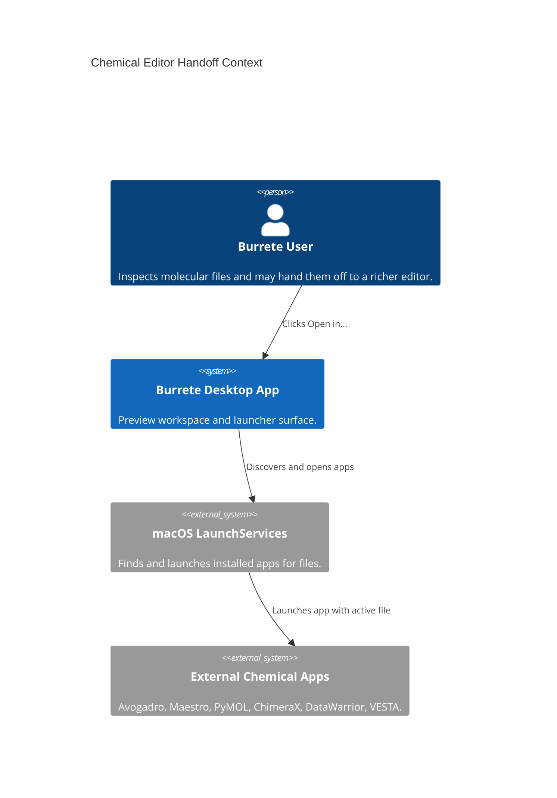
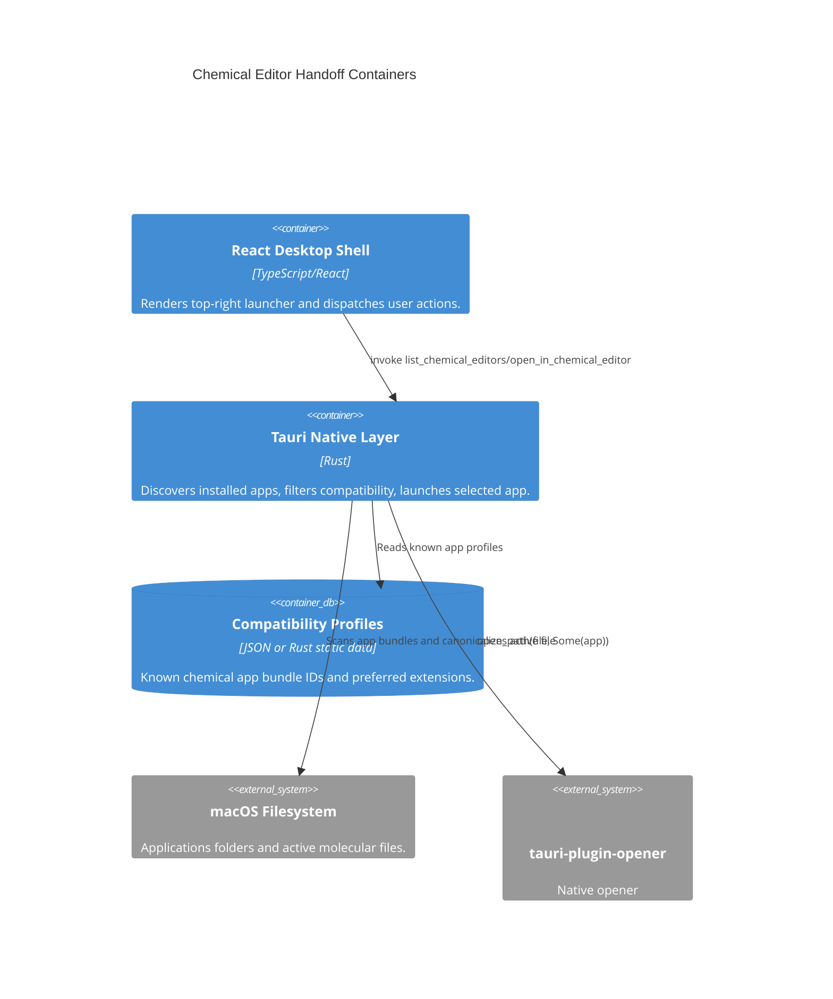
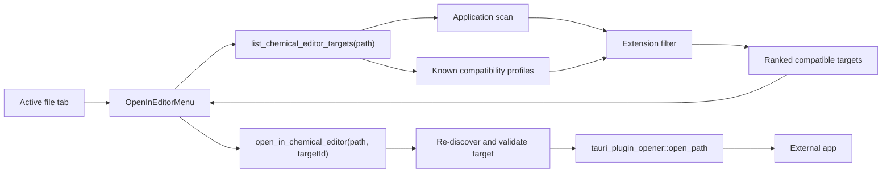

# Architecture

## Context



## Container View



## Component Design

### Native

Add a small native command surface:

- `list_chemical_editor_targets(path: String) -> Vec<ChemicalEditorTarget>`
- `open_in_chemical_editor(path: String, app_id: String) -> Result<(), String>`

Suggested Rust model:

```rust
#[derive(Debug, Serialize)]
#[serde(rename_all = "camelCase")]
pub(crate) struct ChemicalEditorTarget {
    id: String,
    name: String,
    bundle_id: Option<String>,
    app_path: String,
    rank: u16,
    supported_extensions: Vec<String>,
    match_reason: String,
}
```

Implementation rules:

- Canonicalize the active file path before launch.
- Discover apps under `/Applications`, `~/Applications`, and one nested level
  below `/Applications` for suites such as Schrodinger.
- Read bundle IDs and document extensions from `Contents/Info.plist`.
- Apply known app profiles before generic document-type matching.
- Ignore wildcard-only matches (`*`, `****`) unless the app has a known Burrete
  compatibility profile for the active extension.
- Sort by rank, then name.
- Launch with `tauri_plugin_opener::open_path(file_path, Some(app_path_or_name))`
  after verifying the selected app came from the discovered target list.

### Frontend

Add:

- `apps/desktop/src/lib/chemical-editors.ts` for frontend types and filtering
  helpers if needed.
- `apps/desktop/src/components/open-in-editor-menu.tsx` for the control.
- New `ShellActions` methods:
  - `refreshChemicalEditorTargets(path: string)`
  - `openPathInChemicalEditor(path: string, targetId: string)`

Mount the component in `chrome-trailing-controls` before the dock buttons. It
should be hidden or disabled when there is no active local file.

### UI Shape

The trigger should be a compact pill:

- 28-32 px high
- app icon square at the left
- chevron at the right
- tooltip: `Open in <preferred app>`
- click on main trigger opens the preferred app
- click on chevron opens the dropdown

The dropdown should contain:

1. compatible chemical apps
2. separator
3. `Reveal in Finder`
4. `Open with Default App`

## Compatibility Profiles

Keep profiles small and explicit. A first-pass profile can be static Rust data
or JSON under `config/chemical-editors.json`.

Recommended initial profile:

| Bundle ID | Rank | Extensions |
| --- | ---: | --- |
| `com.schrodinger.Maestro` | 10 | `mae`, `maegz`, `cms`, `sdf`, `sd`, `mol`, `mol2`, `pdb`, `ent` |
| `cc.avogadro` | 20 | `xyz`, `mol`, `sdf`, `sd`, `pdb`, `ent`, `mol2`, `cube`, `cub`, `cif` |
| `edu.ucsf.cgl.ChimeraX` | 30 | `pdb`, `pdbqt`, `pqr`, `cif`, `mmcif`, `bcif`, `mol2`, `sdf`, `map`, `ccp4`, `mrc`, `dcd`, `xtc` |
| `com.schrodinger.pymol` | 40 | `pdb`, `ent`, `cif`, `mmcif`, `mol2`, `sdf`, `pse`, `pml` |
| `com.pymolai.app` | 45 | `pdb`, `cif`, `mmcif`, `mol2`, `sdf`, `pse`, `pml` |
| `org.openmolecules.datawarrior` | 50 | `sdf`, `sd`, `csv`, `tsv`, `txt`, `dwar` |
| `com.schrodinger.BioLuminate` | 60 | `mae`, `maegz`, `sdf`, `sd`, `mol`, `mol2`, `pdb`, `ent` |
| `com.schrodinger.Materials Science` | 65 | `mae`, `maegz`, `sdf`, `sd`, `mol`, `mol2`, `pdb`, `ent`, `cif`, `cube`, `cub`, `vasp` |

VESTA needs bundle ID verification in implementation because the inspected
command did not print it. It should still be matched by app name/path with a
profile for `cif`, `mcif`, `xyz`, `cube`, `cub`, `vasp`, `xsf`, and related
crystal/volume formats.

## Data Flow



## Security Boundary

The frontend must not send arbitrary shell commands or arbitrary app paths to
execute. It should send a selected target ID. The native command should
reconstruct the target list for the active path and launch only if the requested
ID exists in that list.
