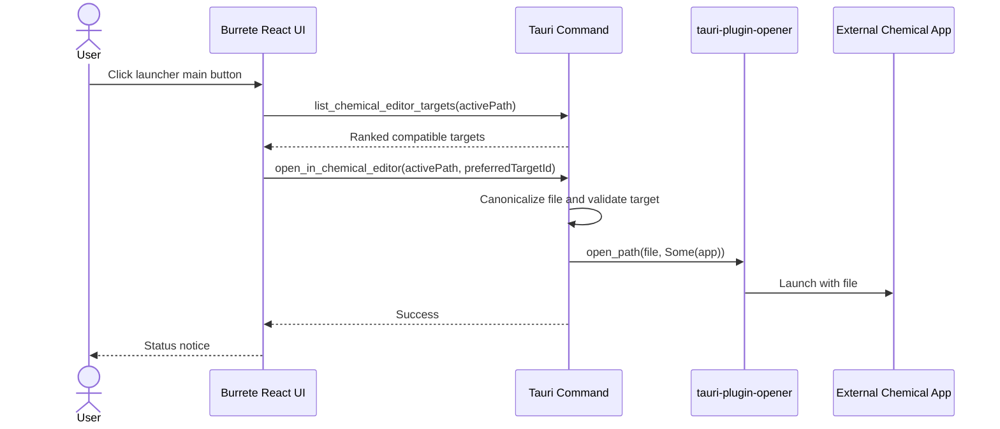
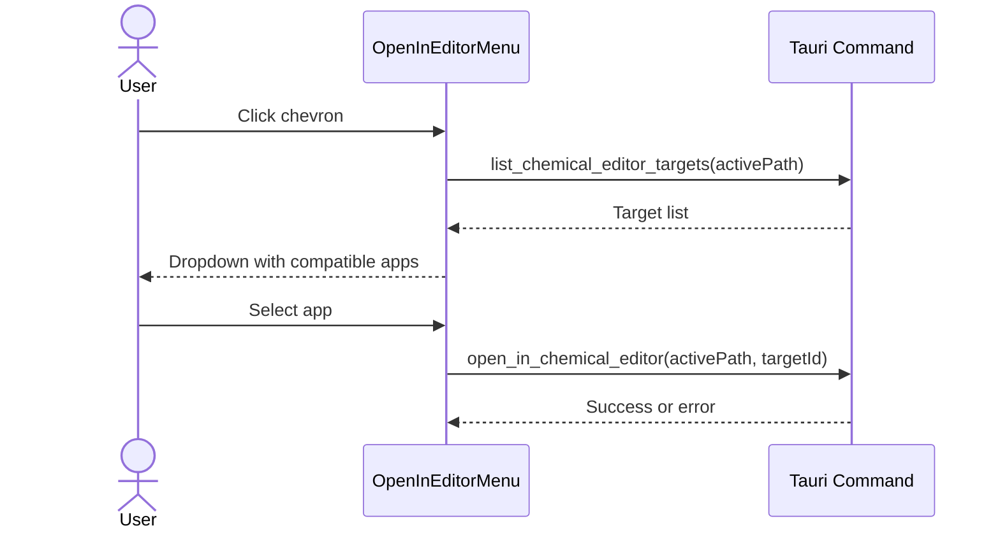

# Behavior

## User Flows

### Open Active Structure In Preferred Editor

### Choose Another Editor

## Empty States

- No active file: hide the launcher or render disabled with tooltip
  `Open a file to use external editors`.
- Active temporary/inline document without a real path: show only internal
  actions such as Ketcher if applicable; do not offer external launch.
- No compatible apps found: dropdown shows `Reveal in Finder` and `Open with
  Default App`, plus a disabled row `No compatible chemical editors found`.
- Browser dev runtime: disable native app discovery and keep `Reveal in Finder`
  fallback behavior only if existing browser fallback can support it.

## Matching Rules

1. Extract the normalized extension from the active path. Preserve compound
   extensions such as `mae.gz`, `pdb.gz`, and `sdf.gz` when relevant.
2. Match installed known app profiles first.
3. Match explicit `CFBundleTypeExtensions` from `Info.plist` second.
4. Ignore wildcard-only document declarations unless a known profile also
   matches.
5. Prefer true chemical apps over general apps.
6. Prefer editor-capable apps over viewer-only apps when rank is otherwise tied.

## Preferred App Selection

The preferred app should be the first ranked compatible app. Reasonable default
ranking for this machine:

- Schrodinger files: Maestro first.
- SDF/MOL/MOL2: Maestro, Avogadro, DataWarrior/PyMOL depending on format.
- PDB/CIF/mmCIF: ChimeraX or PyMOL, with Maestro available.
- XYZ/CUBE/VASP/crystal formats: VESTA and Avogadro.
- CSV/TSV molecule tables: DataWarrior.

Future user preferences can override rank, but that should not be part of the
first implementation unless explicitly requested.

## Visual Details

The screenshot uses:

- dark translucent popup
- compact rows with app icons
- icon-led trigger with chevron
- hover tooltip for the currently focused target

Burrete should use existing theme variables and `radix-menu` styling. The only
new UI requirement is icon support in menu rows and trigger. The menu should not
be a large panel, settings page, or explanatory card.

## Failure Handling

- App disappeared between listing and launch: refresh targets and show
  `Editor is no longer available`.
- File disappeared: show canonicalization error with the path.
- Launch failed: show `Open in <app> failed` and include the native error in
  details.
- Unsupported active document: keep the menu disabled rather than guessing.
