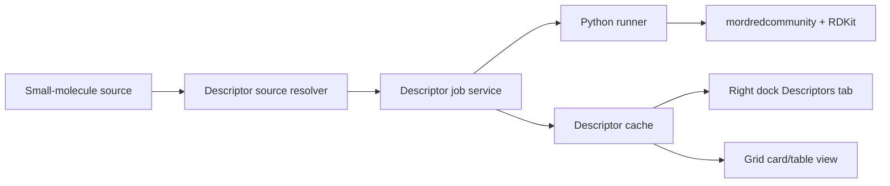

# Architecture

## Components

## Source Resolver

The source resolver maps the current UI context to a descriptor source.

Source kinds:

- `document`: active single-molecule document.
- `grid`: active collection document.
- `grid-row`: selected row in a collection.
- `ketcher`: current Ketcher sketch export supplied by the React Ketcher page.

Each source must provide:

- a stable source id,
- source kind,
- source hash,
- molecule payload format,
- molecule payload text or a host-created payload reference for transient
  Ketcher sketches,
- display label,
- invalidation key,
- whether the payload is single-molecule or collection.

Unsupported contexts should produce a structured disabled reason instead of a
runtime error.

## Job Service

Descriptor calculation must run as a background job controlled by Rust, not by
the iframe. The job service should provide:

- install/runtime status,
- run creation,
- progress reporting,
- cancellation,
- cached result lookup,
- error normalization.

The iframe and React shell should never run long descriptor work directly.

## Runner Boundary

The Python runner should communicate over JSONL or bounded JSON files, not via
shell-expanded molecule strings. Inputs should be file paths or stdin payloads
created by the Rust side.

The runner should return typed descriptor results:

- numeric values,
- text values,
- missing values,
- per-descriptor calculation errors,
- engine metadata.

## UI Data Flow

Single molecule:

1. The active document changes.
2. The right dock resolves descriptor eligibility.
3. The user runs or refreshes descriptors.
4. The descriptor tab renders summary and descriptor groups from cache.

Collection:

1. The grid runtime opens a molecule collection.
2. The right dock shows descriptor run controls and filters.
3. A descriptor job populates the grid runtime descriptor tables.
4. `grid_fetch_page` applies descriptor filters and sort.
5. The grid renders cards or a table from the same page result.

Ketcher:

1. Ketcher exports molfile or SMILES for the current sketch.
2. React passes the exported payload to the descriptor command or asks Rust to
   create a temporary payload reference.
3. The descriptor tab shows values for the sketch.
4. Optional later actions can append the sketch plus descriptors to a collection.
