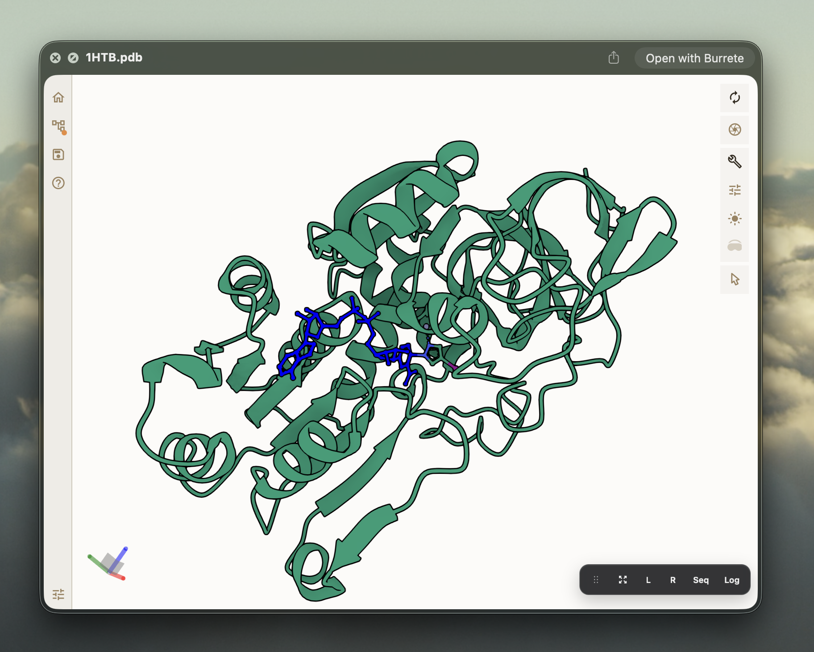

<h1 align="center">Burrete</h1>

<p align="center">Finder-native molecular structure previews for macOS, powered by Mol*.</p>

<p align="center">
  
  <a href="https://opensource.org/licenses/MIT"></a>
  
  
  
</p>

<p align="center">
  
</p>

## What Is Burrete?

Burrete is a small macOS app that lets Finder preview molecular structure files.
Select a structure file, press Space, and Burrete shows an interactive Mol*
viewer directly inside the native Quick Look window.

It is useful when you want to inspect structures quickly without opening a full
molecular modeling environment.

## Download

The easiest way to install Burrete is from the GitHub Releases page:

[Download the latest Burrete release](https://github.com/SergeiNikolenko/Burette/releases/latest)

1. Open the latest release.
2. Download the `Burrete-<version>.zip` file.
3. Unzip it.
4. Move `Burrete.app` to your `Applications` folder.
5. Open Burrete once from `Applications`.

After that, use Finder as usual: select a supported molecular structure file and
press Space to preview it.

## Supported Files

Burrete supports common molecular structure formats:

- PDB and PDBQT
- PDBx/mmCIF and BinaryCIF
- SDF, MOL, and MOL2
- XYZ and GRO

Double-clicking a supported file can open it in Burrete. Pressing Space keeps
using the Quick Look preview.

## Preview Features

Burrete keeps the preview compact and Finder-friendly:

- interactive 3D molecular structures powered by Mol*
- protein ribbons and ligands in the same scene
- a transparent Quick Look background that fits the macOS preview frame
- a small floating toolbar for fullscreen and optional Mol* panels
- optional sequence, log, left, and right Mol* panels when you need them

## Settings

Burrete runs as a menu bar app. Its settings window includes:

- launch and menu bar behavior
- transparent or opaque preview background
- default visibility for Mol* panels
- Finder file association registration
- preview cache cleanup
- log access
- update checks for stable and beta GitHub Releases

## Build From Source

Most users should download Burrete from
[GitHub Releases](https://github.com/SergeiNikolenko/Burette/releases/latest).
If you want to build it yourself, clone the repository and run:

```bash
./scripts/doctor.sh
./scripts/build.sh
./scripts/install.sh
```

The local installer places the app here:

```text
~/Applications/Burrete.app
```

## License

MIT
