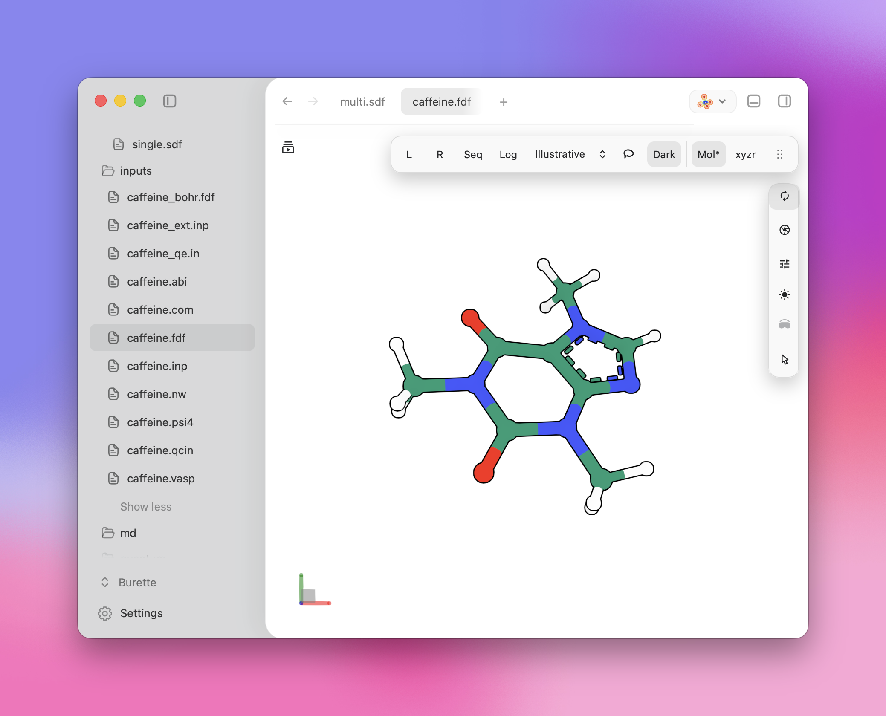

<h1 align="center">Burrete</h1>

<p align="center">
  A macOS molecular file workspace with Finder Quick Look previews, Mol* 3D,
  external xyzrender SVG rendering, RDKit molecule grids, and Ketcher sketching.
</p>

<p align="center">
  
  <a href="https://opensource.org/licenses/MIT"></a>
  
  
  
</p>

<p align="center">
  
</p>

## What Is Burrete?

Burrete is a macOS desktop app and Finder Quick Look extension for molecular
structure files. It is built for the small daily loop of computational
chemistry, structural biology, and cheminformatics work: open a structure,
confirm what it is, switch renderer when needed, compare files in tabs, and
recover quickly when Quick Look or renderer caches need maintenance.

Use it in two ways:

- **Finder previews:** select a molecular file in Finder and press Space.
- **Desktop workspace:** open Burrete directly to inspect files in tabs, browse
  project folders, search commands and structures, sketch molecules, review
  collections, and send files to external chemistry tools.

Burrete is intentionally a compact utility, not a full molecular modeling
environment.

## Download

You can install Burrete with the Homebrew tap:

```bash
brew tap SergeiNikolenko/burrete
brew install --cask burrete
```

Check the cask version when you need to confirm a specific release:

```bash
brew info --cask SergeiNikolenko/burrete/burrete
```

For the latest stable GitHub release, use the Burrete Bun CLI:

```bash
bunx burrete latest
bunx burrete install
bunx burrete doctor
```

The Bun installer places Burrete in `~/Applications` by default. Use
`bunx burrete install --system` only when you intentionally want the app in
`/Applications` for all users. If Finder previews do not appear after install,
run `bunx burrete doctor` to check the app bundle, Quick Look extension,
`qlmanage`, and installed version.

You can also download Burrete from the GitHub Releases page:

[Download the latest Burrete release](https://github.com/SergeiNikolenko/Burrete/releases/latest)

1. Open the latest release.
2. Download the `Burrete-<version>.zip` file.
3. Unzip it.
4. Move `Burrete.app` to your `Applications` folder.
5. Open Burrete once from `Applications`.

## Quick Start

After installation:

1. Open `Burrete.app` once so macOS registers the app and Quick Look extension.
2. In Finder, select a supported molecular file and press Space.
3. Open Burrete directly for the full workspace:
   - `Cmd+O` opens molecular structure files.
   - `Cmd+P` or `/` opens the command palette.
   - `Cmd+,` opens settings.
   - The sidebar browses project folders, nested structures, and recent files.
4. If previews do not appear, run:

```bash
bunx burrete doctor
```

## Supported Files

Burrete supports several preview paths. Some formats open directly in Mol*,
some use the RDKit grid runtime, and some require the external `xyzrender`
renderer.

| Path | Formats | Notes |
| --- | --- | --- |
| Mol* interactive 3D | PDB, ENT, PDBQT, PQR, CIF, MMCIF, MCIF, BCIF, SDF, SD, MOL, MOL2, XYZ, GRO | Default path for most structure files. XYZ can also use `xyzrender`. |
| RDKit molecule grids | SDF, SD, SMILES, SMI, CSV, TSV | Collection view with search, sorting, SMARTS filtering/highlighting, selection, append/merge, and export. |
| External xyzrender | XYZ, CUB, CUBE, ABI, COM, FDF, IN, INP, LOG, NW, OUT, PSI4, QCIN, VASP, MAE, MAE.GZ, MAEGZ, CMS | Requires a local `xyzrender` executable. Used by default for single-frame XYZ and required for external-renderer-only formats. |
| Molecular dynamics / topology | XTC, TRR, DCD, NCTRAJ, LAMMPSTRJ, TOP, PSF, PRMTOP | Registered as molecular files and routed to Mol* where supported by the runtime. |
| OpenMM coordinate artifacts | XML, INPCRD, RST7, CRD, RST, STATE | Render as structures when standalone coordinates are present, with the raw text available in the document surfaces. System XML without positions falls back to text. |
| OpenMM workflow artifacts | PAR, PRM, RTF, STR, KEY, CHK, CHECKPOINT | Open as text/workflow artifacts. Binary checkpoints show metadata because OpenMM checkpoint payloads are tied to the matching system, platform, version, and hardware context. |
| FEP network workspace | GraphML | Opens a ligand network preview workspace rather than a standard molecule preview. |

Multi-frame XYZ files stay in Mol* when Burrete detects trajectory content so
the native trajectory controls can show the available frames. When you rotate a
molecule in Mol* and switch to `xyzrender`, Burrete can pass the current
orientation through the renderer handoff. CUBE, CIF, MMCIF, MCIF, XYZ, and
external-renderer input previews expose an optional VESTA handoff when VESTA is
installed.

## Desktop Workspace

Opening Burrete directly gives you a compact molecular workspace:

- tabbed previews that keep renderer state alive while you switch files
- a project sidebar for folders, nested structures, recent files, and search
- a command palette for opening files, switching renderers, maintenance actions,
  exports, project navigation, Ketcher, and FEP network previews
- right and bottom docks for comparing structures, text files, Ketcher, grids,
  and workflow panels
- "Open In" actions for Finder, the default app, or discovered chemistry editors
- text-file viewing for logs, scripts, configs, and related project files

## Molecule Collections and Ketcher

Burrete includes an RDKit-powered collection grid for SDF, SMILES, CSV, and TSV
files. The grid supports search, sorting, SMARTS filtering/highlighting,
selection, infinite loading, append/merge workflows, and export.

The desktop app also includes a Ketcher small-molecule editor. You can sketch a
molecule, import/export common small-molecule formats, send a sketch to Mol*,
`xyzrender`, or a collection grid, and edit grid rows through Ketcher.

Macromolecule editing is not enabled in the current Ketcher integration.

## Workspace Workflows

Beyond single-file previews, the desktop workspace includes focused workflows
for structure triage:

- `xyzrender` sheets for comparing SVG-rendered structures and exported artwork
- docking and pose-review surfaces backed by the shared Mol* viewer runtime
- FEP network GraphML previews with ligand cards and grid handoff
- FEP setup panels for assembling ligand-network inputs

These workflows live in the desktop app. Finder Quick Look remains optimized
for quick file previews.

## Settings and Maintenance

Burrete settings cover:

- General workspace defaults and open documents
- Appearance, themes, and preview backgrounds
- Keyboard shortcuts and command-palette navigation
- Structure rendering, including Auto, Mol*, and external `xyzrender`
- Stable and beta update checks
- Files, recent structures, and project folders
- Burrete/Codex integration status
- Quick Look reset, preview cache cleanup, logs, diagnostics, and maintenance

Optional integrations include a local `xyzrender` executable, VESTA, and
external chemistry editors discovered by macOS.

## Build From Source

Most users should install Burrete with Homebrew, the Bun CLI, or
[GitHub Releases](https://github.com/SergeiNikolenko/Burrete/releases/latest).
If you want to build it yourself, clone the repository and run:

```bash
./scripts/doctor.sh
./scripts/build.sh
./scripts/install.sh
```

The local installer places the app here:

```text
~/Applications/Burrete.app
```

Current project documentation starts at [docs/README.md](docs/README.md).

## Development

Burrete follows the Writer Computer development convention of using Vite+
through the `vp` CLI. Use `vp` as the entrypoint for frontend work and
JavaScript validation:

```bash
vp install
vp dev
vp check
vp test
vp build
```

Existing Burrete package scripts may still be run through `vp run <script>` for
project-specific checks, but day-to-day development and JavaScript validation
should use the Vite+ built-ins above. Rust validation runs from
`apps/desktop/src-tauri`; native release scripts remain under `scripts/`. See
[docs/vite-plus.md](docs/vite-plus.md) and [docs/releasing.md](docs/releasing.md).

The Quick Look extension caches generated runtime files under the extension
container. After replacing the app, refresh Quick Look with:

```bash
qlmanage -r
qlmanage -r cache
killall quicklookd 2>/dev/null || true
```

## License

MIT
