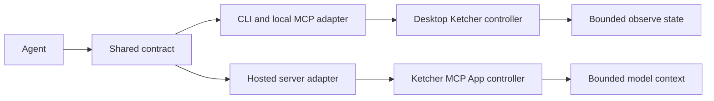

# Ketcher Agent Bridge Cross-Surface Design

**Status:** Approved direction as of 2026-07-15, based on `origin/main` at
`c81c1d17589db36487f854683c845b8c92d9ff18`.

## Goal

Make Ketcher a first-class agent-operated surface in both Burrete runtimes:

1. the local desktop/browser-shell workspace controlled through the repository
   CLI and local Codex plugin; and
2. the hosted ChatGPT MCP App rendered inside the conversation.

Both surfaces must share one command, state, error, revision, and context
contract. The agent may update the live canvas immediately. Saving or exporting
the resulting structure remains a separate, explicit user action.

The completed loop identifies one exact editor, observes a bounded revisioned
snapshot, replaces/clears/highlights the live canvas, reflects user selection in
the next turn, exports full structure only on request, and persists only through
explicit save or download.

## Non-goals

- Hosted Ketcher neither controls local Burrete nor becomes a durable shared
  molecular workspace.
- Live edits will not overwrite source files, grid rows, collections, or
  previously saved artifacts automatically.
- The bridge accepts complete replacement structures, not a general chemistry
  transformation language.
- Mol* selection-to-Ketcher atom mapping and automatic 2D/3D round-tripping are
  outside this feature. Existing explicit Ketcher-to-viewer actions remain.
- Quick Look, native document contracts, and the source-built iPhone app remain
  unchanged; physical-iPhone ChatGPT remains required hosted QA.

## Existing Boundaries

- `KetcherEditorApi` already owns structure import/export and change events;
  `KetcherPage` owns draft recovery, files, grid rows, and downstream viewers.
  Selection, highlights, counts, and agent routing are missing.
- `use-agent-session.ts` observes `ViewerDocument` and routes non-shell actions
  only to Mol*. Ketcher is not an agent target today.
- The hosted plugin already uses MCP Apps and `ui/update-model-context` for
  bounded Mol* context, but is currently stateless and read-only.
- All three Ketcher packages are aligned at `3.15.0`; `indigo-ketcher` is
  `1.43.0`. The hosted bundle must preserve one aligned copy.

## Considered Architectures

The chosen design is one focused domain-contract package with native desktop
and hosted adapters. It preserves existing desktop file/grid/viewer ownership
and prevents hosted sandbox concerns from leaking into local sessions.

A universal MCP App was rejected because it would replace the existing desktop
Ketcher tab and file workflows with an iframe. Independent bridges were
rejected because bounds, revisions, errors, and atom-index semantics would
inevitably drift. Shared conformance tests enforce parity.

## Architecture



The shared package will be `@burrete/ketcher-agent-contract`. It may depend on
Zod for strict runtime schemas, but it must not depend on React, Ketcher, MCP,
Tauri, the browser shell, or hosted-server code.

It owns the `burrete-ketcher-agent/v1` version, strict command/result/context
schemas, bounds, error codes, pure revision/dirty transitions, and shared
conformance fixtures.

The package does not own Ketcher calls, filesystem persistence, iframe
communication, session files, or hosted command delivery.

## Editor Identity and Revisions

Every mounted editor has a stable `surfaceId` for its lifetime. A local
`surfaceId` is derived from the owning tab/page identity. A hosted `surfaceId`
is an opaque random 128-bit identifier created by `open_ketcher`; relay
authorization uses a separate signed command capability.

The observable state contains two revisions:

- `structureRevision` changes after a successful user or agent structural edit;
- `interactionRevision` changes after selection or highlight state changes.

`persistedRevision` records the last structure revision confirmed by an explicit
save or download. `dirty` is exactly
`structureRevision !== persistedRevision`.

Initial empty editors start at revision zero and are not dirty. A seed supplied
to `open_ketcher` is baseline hydration: after it loads successfully,
`structureRevision` and `persistedRevision` have the same value. A later
`set_structure` or `clear_structure` is an edit and makes the surface dirty.

Structural edits clear selected and highlighted atom indexes because those
indexes are invalid after topology changes. One logical agent transaction may
emit multiple Ketcher change events, but it increments `structureRevision` only
once and clears interaction state with one `interactionRevision` increment.
Highlights alone do not change `structureRevision` or `dirty`.

## Bounded Snapshot

The common snapshot contains `apiVersion`, `surfaceId`, lifecycle `phase`, all
three revision fields, `dirty`, structure kind/counts, bounded SMILES or
reaction SMILES, bounded selected/highlighted atom arrays with total counts and
truncation flags, the last action ID/status, and explicit capability flags.
`surfaceId` is model-visible; hosted widget credentials are not.

`phase` is one of `loading`, `ready`, `applying`, `exporting`, `recovering`,
`error`, or `disposed`. `structure.kind` is `empty`, `molecule`, or `reaction`.

Automatic observe/model context allows SMILES up to 500 characters, reaction
SMILES up to 1,000, each atom-index array up to 256 items, and text/error
summaries up to 255 characters. Counts are non-negative safe integers.

The snapshot always replaces current interaction state. A selection beyond 256
indexes publishes the first 256 sorted indexes, the total count, and
`selectionTruncated: true`. SMILES and reaction SMILES are included only when
complete within their bound; otherwise they are null with an explicit omission
flag. Invalid truncated chemistry strings are never published. Clearing state
publishes explicit empty/null fields because `ui/update-model-context` is not a
delta protocol.

KET, MOL, RXN, SDF, and CDXML are never included in automatic model context,
`observe.json`, analytics, routine logs, or error messages.

## Commands

All schemas are strict and reject unknown properties. Atom indexes are zero
based. Targeted commands use an envelope containing `apiVersion`, `surfaceId`,
UUID `actionId`, and `expectedRevision`.

| Command | Required input | Effect |
| --- | --- | --- |
| `open_ketcher` | zero or one inline seed or KET/MOL/RXN `contentRef` | Opens or mounts an editor and establishes the baseline revision. |
| `set_structure` | envelope plus one inline input or KET/MOL/RXN `contentRef` | Atomically replaces the canvas and marks it dirty. |
| `clear_structure` | envelope | Atomically replaces the canvas with an empty structure and marks it dirty. |
| `highlight_atoms` | envelope plus up to 256 indexes | Replaces the agent highlight set; an empty list clears it. |
| `get_structure` | envelope plus formats and delivery | Explicitly exports the current revision without marking it persisted. |
| `request_persist` | envelope, format, and sanitized suggested basename | Opens a user-confirmed Save As/download flow; never writes by itself. |

Hosted model-visible server tools are `open_ketcher`, fallback
`control_ketcher`, and explicit `export_ketcher`. When supported, the mounted
app exposes direct `set_structure`, `clear_structure`, `highlight_atoms`, and
`get_structure` tools. Local MCP exposes `burrete.control_ketcher` over the CLI.
All map to the command table above; transport names do not define semantics.

`expectedRevision` means `structureRevision`. It is required for every
targeted command, including highlights, so atom indexes cannot be applied to a
new topology. A mismatch returns `REVISION_CONFLICT` with the latest bounded
snapshot and performs no action.

Inline input is at most 64 KiB UTF-8 in every format. Larger KET/MOL/RXN, up to
1 MiB, must use an opaque `contentRef` created by an explicit local import or
hosted upload. A reference is session-bound, declares size and SHA-256, expires
within 15 minutes, and is deleted after consumption. Thus `actions.json` and
model-visible tool arguments never accumulate megabyte structures. Exactly one
format/source is accepted; there is no precedence rule.

`get_structure` can request KET, MOL, RXN, SDF, SMILES, reaction SMILES, and
CDXML. KET is the canonical lossless representation. Model-visible inline
delivery is capped at 64 KiB total. Larger results must use a local artifact
path or explicit hosted download, up to the 1 MiB structure limit.

Action IDs are idempotency keys retained for the latest 256 terminal actions
and the full relay-capability lifetime. The same ID and payload hash returns the
stored result; another payload returns `REPLAY_CONFLICT`. Every accepted
structural command increments `structureRevision` once, even for equivalent
content. User changes increment only when the coalesced stable KET hash differs;
selection/highlight changes use the same rule on sorted index sets.

## Shared Controller Semantics

Each adapter implements `snapshot`, `setStructure`, `clearStructure`,
`highlightAtoms`, `getStructure`, and internal `markPersisted` controller
operations. Readiness requires Ketcher, Indigo, seed/draft hydration, and, for
the hosted app, the transport handshake.

Commands are serialized per `surfaceId`. Before structural mutation, the
controller captures KET, interaction state, revisions, and editor generation.
Success is reported only when the canvas event, post-change export, and
published snapshot agree on the new revision.

Import/export and recovery each have a 10-second deadline. On timeout, the
controller rejects new commands, invalidates the old generation, and mounts a
fresh editor from the captured pre-state. Old-generation callbacks cannot
commit. It reports failure only after the replacement is ready; failure to
re-establish known state disposes the surface with `RECOVERY_FAILED`. A relay or
session disconnect after a command was claimed returns `OUTCOME_UNKNOWN` with
the action ID; callers must observe and never retry it automatically.

Invalid input, conversion errors, stale targets, or failed exports leave the
canvas, revisions, dirty state, selection, and highlights unchanged.

## Desktop Adapter

The desktop shell adds a small Ketcher controller registry keyed by exact
`surfaceId`. Each `KetcherPage` registers on mount and unregisters on disposal.
Keep-alive pages retain their controller while inactive.

`KetcherEditorApi` gains selection subscription/indexes, agent highlights, and
structure counts. Internal selection APIs stay behind this
runtime-shape-checked adapter; the public controller never exposes them.

The app shell adds a discriminated active-surface identity rather than creating
a fake `ViewerDocument` for Ketcher. `observe.json` gains additive
`activeSurface` and `chemicalEditor` fields while retaining
`burette-agent-control/v1` compatibility.

Ketcher actions are routed before the Mol* fallback. The action carries the
exact `surfaceId` and `expectedRevision` from the preceding observe plus a new
action ID. Switching tabs after observe returns `STALE_TARGET`; it must not edit
the newly active tab.

The repository CLI remains authoritative: `observe` returns bounded state,
`act` queues typed actions and waits for controller completion, and explicit
exports use session artifacts instead of raw structures in `observe.json`.

Local `contentRef` values resolve only inside the current session artifact
directory, are hash-checked and single-use, and are removed on consumption or
session cleanup. They never carry caller-supplied filesystem paths.

After the CLI contract is in place, the local MCP facade adds
`burrete.control_ketcher`. It validates a discriminated action union and wraps
the existing CLI `act` path. It is not an arbitrary action passthrough. The
existing molecule-collection skill is extended; a new routing skill is not
required.

The current draft state remains crash recovery only. Updating
`saveKetcherDraft` does not set `persistedRevision` and does not count as saving
the source file.

## Hosted MCP App

The hosted plugin adds a separate stable resource:

```text
ui://burrete/ketcher-editor-v1.html
```

The Mol* `ui://burrete/molecular-viewer-v21.html` resource and existing preview
tools remain unchanged.

The hosted editor uses the real Burrete hosted shell and the existing Ketcher
page/controller source. Ketcher and Indigo are lazy, self-hosted chunks, so the
Mol* widget does not pay their startup cost. The build verifies one aligned
copy of Ketcher 3.15.0 and Indigo 1.43.0 and includes no unreviewed CDN runtime.

`open_ketcher` is the model-visible mounting tool. The mounted app registers
the same typed controller operations as app tools. It publishes the full
bounded snapshot after a 200 ms latest-wins debounce on structure, selection,
or highlight changes.

The official ChatGPT compatibility contract guarantees MCP server tools,
tool-input/result notifications, and `ui/update-model-context`; it does not
separately guarantee that a model can call a dynamically registered tool on a
specific already mounted iframe. Therefore direct app-tool routing is an
optimized transport, not an architectural assumption. In that transport, the
host-bound iframe route is authoritative and `surfaceId` is only a stale-target
assertion.

## Hosted Command Routing and Relay

The hosted adapter implements two transports behind the same controller.
`RelayTransport` is the production default. `MountedAppTransport` is enabled
only after app tools are registered before `App.connect()`, negotiated host
capabilities confirm support, and two-card web/iPhone conformance proves exact
iframe routing. Browser-global heuristics do not enable it.

The relay is serverless-compatible and uses a managed Redis-compatible store.
It contains only short-lived registrations, commands, acknowledgements, and
referenced payloads. This intentionally changes the hosted deployment from
stateless to transiently stateful; it is not a durable workspace.

Production requires `KETCHER_RELAY_REDIS_URL`,
`KETCHER_RELAY_REDIS_TOKEN`, and `KETCHER_RELAY_SIGNING_SECRET`. Ketcher
mutation tools remain unregistered when they are absent; there is no production
in-memory fallback. The store uses TLS and provider-side encryption at rest.

Relay rules:

- `open_ketcher` returns model-visible `surfaceId` plus a signed
  `commandCapability` binding it to a server-side session nonce, expiry,
  allowed actions, and, when available, the connector subject.
- A separate HMAC-signed widget token is delivered only in tool-result `_meta`
  and is required for widget polling and acknowledgement.
- An editor registration lives until teardown or the 15-minute TTL. Command
  payloads and full acknowledgements are deleted after completion; only a
  payload-free action ID/hash/revision dedupe record remains until expiry.
- Action IDs and payload hashes enforce dedupe and replay rejection. A command
  capability permits at most 30 enqueues/minute; a widget token permits 120
  polls/minute with hidden-state backoff.
- Pending commands retain the shared inline/reference limits.
- The widget polls only while visible, backs off while hidden, and stops on MCP
  App teardown.
- `control_ketcher` enqueues one typed command and waits up to 25 seconds for
  the exact terminal acknowledgement. An unclaimed expired command is
  atomically cancelled; a claimed command without a terminal ack returns
  `OUTCOME_UNKNOWN`, never a retryable failure.
- Results are correlated by `surfaceId`, action ID, and expected revision.
- Two mounted editors must be independently addressable; cross-editor delivery
  is a release-blocking security failure.
- Command payloads and molecular content are excluded from application logs and
  analytics.

Provider, region, encryption, access logging, retention, rate limits, and
molecular-content handling must be documented in deployment and public privacy
contracts before any preview uses non-public chemistry. Until that review,
relay tests use only public fixtures.

## Persistence

Live mutation and persistence are intentionally separate.

### Local

`request_persist` may suggest a sanitized basename but never accepts a path. It
returns `awaiting_user` after opening the native Save As flow, so CLI completion
does not wait on a human. The existing UI owns destination choice and overwrite
confirmation; the generic agent bridge cannot overwrite.

Only a confirmed write of the exact current revision calls
`markPersisted(revision)`. Cancellation or a concurrent edit leaves `dirty`
true and closes the persistence request.

### Hosted

`export_ketcher` prepares a visible download action. On a user gesture, the
widget feature-detects MCP Apps `ui/download-file` and uses the host-mediated
confirmation flow. If unavailable, the visible action opens a one-time signed
HTTPS resource containing one bounded temporary export.

Hosted export is never started in the background. A host-confirmed download of
the exact current revision updates `persistedRevision`; issuing or opening a
fallback signed link does not, because completion cannot be proven.

## Data Flows

- Local: `observe` captures the exact surface and revision; MCP validates and
  sends typed CLI `act`; the registry resolves that controller; completion is
  reported only when immediate `observe` sees the resulting revision.
- Hosted: `open_ketcher` mounts a baseline; after Ketcher, Indigo, and bridge
  readiness, a direct or relay command reaches that surface; the app publishes
  the completed bounded snapshot through `ui/update-model-context`.
- User changes: Ketcher events update the proper revision immediately, while a
  200 ms latest-wins worker coalesces SMILES/count export. Desktop updates
  `observe.json`; hosted replaces model context.

## Error Contract

All failures use the same shape and one of these stable codes:

| Code | Meaning |
| --- | --- |
| `NOT_READY` | Editor, structure service, hydration, or transport is not ready. |
| `INVALID_INPUT` | The strict command schema failed. |
| `INVALID_STRUCTURE` | Ketcher rejected or could not normalize the structure. |
| `UNSUPPORTED_FORMAT` | The requested input or output format is unsupported. |
| `PAYLOAD_TOO_LARGE` | A declared size or item bound was exceeded. |
| `REPLAY_CONFLICT` | An action ID was reused with a different payload. |
| `STALE_TARGET` | The requested editor no longer exists or is not the observed target. |
| `REVISION_CONFLICT` | `expectedRevision` differs from the current structure revision. |
| `INVALID_ATOM_INDEX` | A highlight/selection index is outside the current structure. |
| `TIMEOUT` | A bounded operation was cancelled or rolled back before its deadline. |
| `OUTCOME_UNKNOWN` | Transport was lost after claim; observe by action ID before doing anything else. |
| `RECOVERY_FAILED` | The pre-command KET could not be restored safely. |
| `EXPORT_FAILED` | Ketcher could not produce the requested representation. |
| `PERSIST_CANCELLED` | The user or host cancelled save/download. |
| `TRANSPORT_UNAVAILABLE` | Neither direct mounted-app routing nor relay is usable. |

Errors contain a bounded human message and the latest safe snapshot when one is
available. They never contain raw KET/MOL/RXN/CDXML or command payloads.

Mutating commands are never retried automatically after an ambiguous timeout.
The caller must observe again and submit a new action against the reported
revision.

## Security and Privacy

- Local commands target exact registered surfaces and do not use a global
  `window.message` or active-tab-only fallback for Ketcher.
- Hosted and local transports never connect to one another.
- Hosted resources use the MCP Apps sandbox, the existing stable production
  origin, self-hosted assets, and no additional frame or device permissions.
- Tool annotations accurately mark live editor mutations as non-read-only,
  closed-world operations. Save/download remains explicit.
- All schemas are validated at the MCP/CLI boundary, session/relay boundary,
  and controller boundary.
- Unknown fields, non-integer indexes, duplicate oversized arrays, and invalid
  UTF-8 byte lengths fail closed.
- No command provides arbitrary JavaScript, shell execution, URL opening,
  filesystem traversal, or remote job submission.
- Hosted analytics remain limited to the fixed widget pageview and never include
  structure, selection, identifiers, capabilities, filenames, or command data;
  application and provider logs redact all relay tokens and payloads.

## Validation Strategy

### Shared conformance suite

Both adapters run the same fixtures and assertions:

- molecule `CCO`, reaction, and query-bearing KET round-trips with correct
  counts and semantics;
- inline/reference/array bounds at N and N+1, plus reference cleanup;
- stale target/revision, invalid import, and timeout generation swap are atomic;
- duplicate action replay is idempotent, while conflicting/expired capabilities
  and payloads fail closed;
- selection and highlight are independent, explicitly cleared, and invalidated
  together by a structural replacement;
- action completion is causally visible in the immediate next snapshot;
- two simultaneous editors remain isolated; and cold start before
  `struct-service-initialized` never reports a successful empty canvas.

### Focused repository checks

- Contract/controller tests, plus a real browser Ketcher smoke.
- Desktop session, CLI, and local MCP routing/compatibility tests.
- Hosted resource, CSP, asset, Apps handshake, relay, and export tests.
- Lock check for exact Ketcher/Indigo version alignment and one Ketcher core
  instance, plus a bundle check that Mol* does not eagerly load those chunks.

### Real proof surfaces

Passing tests on one surface does not prove another. Release evidence must cover:

1. browser-dev shell with a real SMILES and KET fixture;
2. packaged macOS app with unique `BURRETE_DEV_FLAVOR`, local Codex MCP, and
   source-file hash unchanged until confirmed Save As;
3. hosted Vercel preview with a fresh ChatGPT developer connector;
4. fresh production ChatGPT web card; and
5. a fresh production card on a physical iPhone.

The hosted smoke opens `CCO`, has the model replace it with `CCN` in the same
card, verifies next-turn user selection and agent highlights, explicitly
downloads/reopens an equivalent KET, and repeats with two mounted cards to prove
routing isolation.

Old conversation cards are not deployment evidence because resource/tool
metadata and cached widget assets may belong to an earlier connector version.

## Implementation Stages

The feature is delivered as reviewable stages but released only after all
cross-surface gates pass:

1. Shared contract package, state machine, limits, fixtures, and conformance
   harness.
2. Ketcher adapter/registry, then desktop observe/act/CLI/local-MCP integration.
3. Browser-shell and packaged macOS live-edit/explicit-save proofs.
4. Hosted resource, lazy assets, app tools, and bounded context.
5. Signed TTL relay and host-mediated export.
6. Vercel, production web/iPhone, docs/privacy, and release review.

Each non-mechanical stage should remain below the repository's focused-change
limits. Generated hosted assets are reviewed through their source and build
contract rather than by editing generated output.

## Documentation Updates

Implementation must update `docs/agent-platform.md`, the local plugin README,
reference alignment, molecule-collection skill and MCP reference, the public
plugin README, hosted privacy/submission metadata, tool schemas/annotations,
and testing-surface documentation when commands or ports change.

## Acceptance Criteria

- Local Codex and hosted ChatGPT use the same versioned command/snapshot/error
  contract.
- The agent can update one exact live Ketcher canvas immediately without
  changing another tab/card; every mutation is revision-checked, atomic, and
  immediately observable.
- User selection becomes bounded next-turn context, while agent highlights stay
  distinct; automatic context never contains connection-table text and omits
  SMILES rather than truncating it.
- Explicit export/persistence honor limits, never overwrite automatically, and
  clear `dirty` only after confirmed persistence of the current revision.
- Ketcher/Indigo cold-start and timeout recovery cannot report a successful
  empty or partially mutated canvas.
- Browser-dev, packaged macOS, production ChatGPT web, and physical iPhone
  evidence all pass before release.

## Protocol References

- OpenAI Apps SDK MCP Apps compatibility:
  <https://developers.openai.com/apps-sdk/mcp-apps-in-chatgpt>
- MCP Apps stable specification:
  <https://github.com/modelcontextprotocol/ext-apps/blob/main/specification/2026-01-26/apps.mdx>
- MCP Apps `App` API, including app tools, model-context updates, and
  host-mediated downloads:
  <https://apps.extensions.modelcontextprotocol.io/api/classes/app.App.html>
